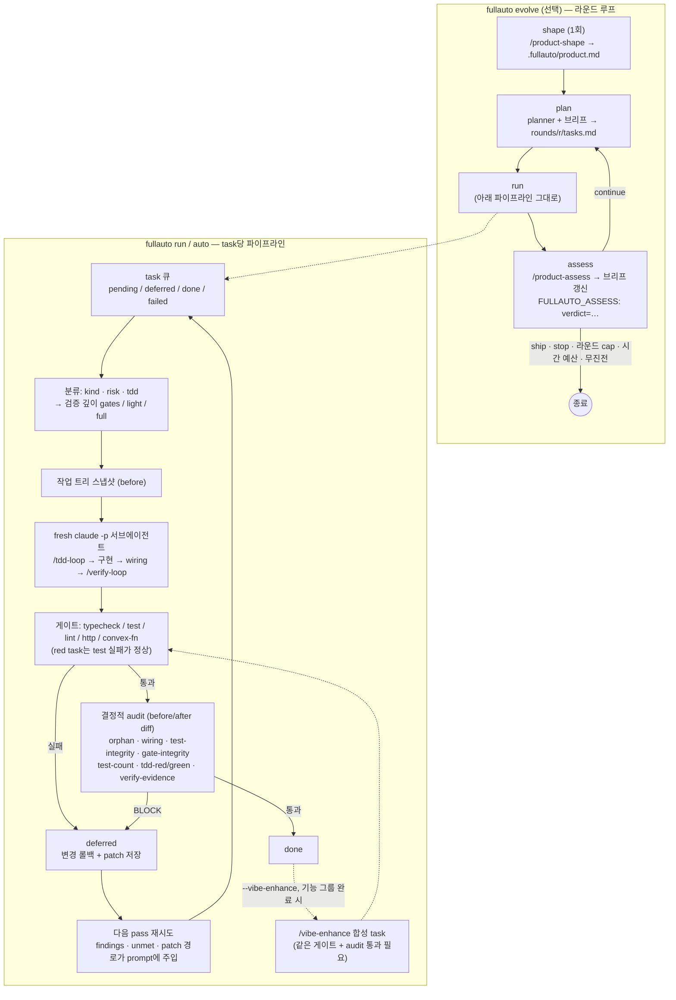

# fullauto-cc

Claude Code용 풀오토 오케스트레이터. `tasks.md`([GitHub Spec Kit](https://github.com/github/spec-kit)의
`/speckit-tasks` 출력물 또는 직접 작성), 자연어 설명, 혹은 한 줄짜리 제품
컨셉을 받아 **task당 하나의 격리된 `claude -p` 서브에이전트**로 순차 실행하고,
사용자가 정의한 게이트(typecheck / test / lint / http / convex-fn)와 **결정적
audit**(고아 코드 · 테스트 무결성 · 게이트 설정 변조 · TDD red/green)으로
"done"을 기계적으로 판정하며, task 위험도에 맞춘 깊이의 `/verify-loop`로
요구사항 충족도까지 자체 교정합니다. 사람에게 되묻는 경로는 없습니다.

## 무엇이 다른가

- **task마다 fresh 컨텍스트** — 하나의 긴 세션이 컨텍스트 고갈 · 드리프트 ·
  조용한 누락으로 무너지는 대신, task 하나 = 서브에이전트 하나. 실패는
  `deferred`로 격리되어 다음 pass에서 재시도되고, 그래도 안 되면 사용자에게
  이유 · 로그 경로와 함께 에스컬레이션됩니다.
- **게이트와 audit이 판정한다, 서브에이전트가 아니라** — `FULLAUTO_RESULT:
  DONE` 같은 성공 주장은 prompt injection으로 위조 가능하므로 믿지 않습니다.
  exit code와 작업 트리의 before/after diff만 봅니다.
- **결정적 audit** — 새 파일이 production 코드에 실제로 import · render · mount
  됐는지, 테스트가 skip · 삭제 · 약화 · tautology로 통과된 건 아닌지, 게이트
  설정이 변조되지 않았는지, red 테스트가 정말 실패했다가 정말 통과했는지를
  순수 함수로 검사합니다. LLM 판단 없음, 설득 불가.
- **적응형 검증 깊이** — config / docs / 저위험 task는 리뷰어 0, 보통 task는 2,
  auth / payments / schema 같은 고위험 task는 4(+design). 리뷰어를 spawn하기
  전에 audit이 먼저 돌아 공짜로 잡히는 결함은 리뷰어 사이클을 소모하지
  않습니다.
- **컨셉 → 제품 (`evolve`)** — 한 줄 컨셉에서 제품 브리프(`product.md`)를
  만들고 plan → run → assess 라운드를 자율 반복합니다. 매 라운드는 위와 동일한
  검증 파이프라인을 통과하고, 판단 레이어(`/product-shape`, `/product-assess`,
  `/ux-walkthrough`)가 다음 라운드의 우선순위를 정합니다.

## 목차

1. [30초 요약](#1-30초-요약)
2. [빠른 시작](#2-빠른-시작)
3. [실행 모드 — run · auto · plan · evolve](#3-실행-모드--run--auto--plan--evolve)
4. [검증 파이프라인 — 게이트 · audit · verify-loop · TDD](#4-검증-파이프라인--게이트--audit--verify-loop--tdd)
5. [스킬 7종](#5-스킬-7종)
6. [tasks.md 레퍼런스](#6-tasksmd-레퍼런스)
7. [설정 레퍼런스 — `.fullauto/config.json`](#7-설정-레퍼런스--fullautoconfigjson)
8. [CLI 레퍼런스](#8-cli-레퍼런스)
9. [왜 `/speckit-implement` 대신 fullauto인가](#9-왜-speckit-implement-대신-fullauto인가)
10. [상태 · 로그 · 리포트](#10-상태--로그--리포트)
11. [트러블슈팅](#11-트러블슈팅)
12. [한계와 설계 노트](#12-한계와-설계-노트)

---

## 1. 30초 요약


```mermaid
flowchart TD
    subgraph EVOLVE["fullauto evolve (선택) — 라운드 루프"]
        direction LR
        Shape["shape (1회)<br/>/product-shape → .fullauto/product.md"] --> Plan["plan<br/>planner + 브리프 → rounds/r/tasks.md"]
        Plan --> Run["run<br/>(아래 파이프라인 그대로)"]
        Run --> Assess["assess<br/>/product-assess → 브리프 갱신<br/>FULLAUTO_ASSESS: verdict=…"]
        Assess -->|continue| Plan
        Assess -->|ship · stop · 라운드 cap · 시간 예산 · 무진전| Stop((종료))
    end
    subgraph RUN["fullauto run / auto — task당 파이프라인"]
        Q["task 큐<br/>pending / deferred / done / failed"] --> Classify["분류: kind · risk · tdd<br/>→ 검증 깊이 gates / light / full"]
        Classify --> Snap["작업 트리 스냅샷 (before)"]
        Snap --> Sub["fresh claude -p 서브에이전트<br/>/tdd-loop → 구현 → wiring → /verify-loop"]
        Sub --> Gates["게이트: typecheck / test / lint / http / convex-fn<br/>(red task는 test 실패가 정상)"]
        Gates -->|실패| Defer["deferred<br/>변경 롤백 + patch 저장"]
        Gates -->|통과| Audit["결정적 audit (before/after diff)<br/>orphan · wiring · test-integrity · gate-integrity<br/>test-count · tdd-red/green · verify-evidence"]
        Audit -->|BLOCK| Defer
        Audit -->|통과| Done["done"]
        Defer --> Next["다음 pass 재시도<br/>findings · unmet · patch 경로가 prompt에 주입"]
        Next --> Q
        Done -.->|"--vibe-enhance, 기능 그룹 완료 시"| Enh["/vibe-enhance 합성 task<br/>(같은 게이트 + audit 통과 필요)"]
        Enh -.-> Gates
    end
    Run -.-> Q
```

한 task가 `done`이 되려면 세 층을 통과합니다 — **싼 것 먼저, 설득 불가능한 것
먼저**: (1) 게이트 exit code, (2) 결정적 audit, (3) 서브에이전트 안에서 도는
`/verify-loop` LLM 리뷰. 1 · 2는 오케스트레이터가 서브에이전트 종료 후
실행하고, 3은 서브에이전트가 prompt에 박힌 깊이대로 실행하며 `verify-evidence`
audit이 그 증거 줄을 확인합니다.

종료는 세 가지로 가드됩니다: 모든 task가 `done`/`failed`, `currentPass >
maxPasses`(기본 4), **무진전 감지**(한 pass가 시작과 동일한 미해결 집합으로
끝나면 즉시 중단). 남은 `deferred`는 `failed`로 승격되어 리포트에 이유와 함께
나옵니다. 추가로 **같은 task가 같은 방식으로 두 번 연속 실패**하면(같은 게이트 +
같은 출력(소요 시간 등 노이즈 제외), 같은 audit BLOCK 집합, 같은 `unmet:` 목록,
또는 timeout 두 번) 그 task는 더 이상 시도하지 않습니다 — 재시도가 prompt에
이전 실패를 받고도 결과를 못 바꿨다는 증거이기 때문입니다. 합성 `ENHANCE-` task는
attempt 1회, `VERIFY-` task는 2회로 제한됩니다(선택적 패스에 `maxPasses`를
쓰지 않음). 서브에이전트가 레이트리밋 backoff(`rateLimitMaxRetries`)를 다
쓰고도 API가 포화 상태면 run은 **일시정지**(exit 75, state 저장)하고
`fullauto resume`으로 이어갑니다 — 다음 task가 똑같은 포화 API에 backoff를 또
소진하며 pass만 태우는 일이 없도록.

---

## 2. 빠른 시작

### 2.1 설치 (한 번만)

```bash
git clone https://github.com/mincheolchae/fullauto-cc.git
cd fullauto-cc
npm install
npm run build
npm link            # `fullauto` 명령을 PATH에 등록
```

`npm run build`는 끝에 `dist/cli.js`에 실행 권한을 줍니다(`postbuild`) — tsc
산출물은 실행 비트가 없어 이 단계가 빠지면 `npm link`가 걸려 있어도
`fullauto: command not found`가 납니다.

전제: Node ≥ 18, `claude` CLI(Claude Code)가 PATH에 (`which claude`), 대상
프로젝트가 git 저장소(audit은 git 스냅샷 기반 — 커밋은 없어도 됨).

**업데이트**: `git pull && npm install && npm run build`. `npm link`와 아래 2.2의
심볼릭 링크는 이 디렉토리를 가리키므로 CLI · 슬래시 커맨드 · 스킬이 한 번에
갱신됩니다(다시 링크할 필요 없음). 확인: `command -v fullauto && fullauto
--version`, `ls -l ~/.claude/skills/verify-loop`.

### 2.2 슬래시 커맨드 + 스킬 설치 (권장)

```bash
mkdir -p ~/.claude/commands ~/.claude/skills
ln -sf "$(pwd)/slash-command/fullauto.md" ~/.claude/commands/fullauto.md
for s in verify-loop tdd-loop wiring-audit vibe-enhance product-shape product-assess ux-walkthrough; do
  ln -sf "$(pwd)/skills/$s" ~/.claude/skills/$s
done
ln -sfn "$(pwd)/skills/_shared" ~/.claude/skills/_shared   # 공유 playbook (스킬 아님) — /product-shape · /vibe-enhance가 읽음
```

`/verify-loop`과 `/tdd-loop`은 서브에이전트 prompt가 직접 지시하므로 거의
필수, `/vibe-enhance`는 `--vibe-enhance`에, `/product-shape` · `/product-assess`
· `/ux-walkthrough`는 `evolve`에 필요합니다. 스킬이 없으면 prompt에 재기술된
포맷으로 폴백하지만 품질은 떨어집니다. 상세는 [5. 스킬 7종](#5-스킬-7종).

### 2.3 프로젝트 초기화 (프로젝트마다 한 번)

```bash
cd /path/to/your/project
fullauto init                  # convex preset (기본) — --backend none|convex|supabase|firebase|rest
```

`.fullauto/config.json`이 생성되고 `.fullauto/`가 `.gitignore`에 추가됩니다.
**반드시 열어서 게이트를 본인 스택에 맞추세요** — 게이트는 "task가 done인가"를
결정하는 계약입니다. 기본 게이트는 `npm run typecheck|test|lint|test:e2e
--if-present`이고, 게이트가 빈 배열이면 run은 시작을 거부합니다. 상세는
[7. 설정 레퍼런스](#7-설정-레퍼런스--fullautoconfigjson).

### 2.4 세 가지 실행 방법

```bash
fullauto run path/to/tasks.md                     # A. tasks.md가 이미 있을 때
fullauto auto "이메일 검증 포함 사용자 CRUD 구현"   # B. 자연어 → planner가 분해 → 실행
fullauto evolve "원격 팀용 습관 트래커"             # C. 컨셉 → 브리프 → 라운드 반복
```

Claude Code 안에서는 `/fullauto`:

```
/fullauto path/to/tasks.md                    # run 모드 (첫 토큰이 경로처럼 보이면)
/fullauto path/to/tasks.md --verify full
/fullauto 사용자 CRUD 엔드포인트 구현            # auto 모드 (그 외)
```

플래그는 항상 첫 토큰 **뒤에** 둡니다 — 첫 토큰이 `--`로 시작하면 디스패처가
모드를 잘못 잡습니다. `evolve`는 슬래시 커맨드가 아니라 터미널에서 직접
실행합니다(몇 시간짜리 unattended 루프).

### 2.5 spec-kit 파이프라인 (spec-kit 1.0.8+)

```
/speckit-specify ...
/speckit-plan ...
/speckit-tasks                          # specs/<feature>/tasks.md 생성
/fullauto specs/<feature>/tasks.md      # /speckit-implement 대신
```

spec-kit 1.0은 커맨드를 `.claude/skills/speckit-*/`에 스킬로 설치하고 하이픈
이름(`/speckit-tasks`)으로 호출합니다. 구버전의 점 구분 이름(`/speckit.tasks`)도
`tasks.md` 문법이 같으므로 그대로 동작합니다. 확장으로 등록하면
`/speckit-tasks` 직후 훅으로 제안받거나 `/speckit-fullauto-run`으로 직접 호출할
수 있습니다:

```bash
specify extension add --dev /path/to/fullauto-cc/extensions/fullauto
```

상세는 [`extensions/fullauto/README.md`](extensions/fullauto/README.md).

---

## 3. 실행 모드 — run · auto · plan · evolve

### 3.1 `run` — tasks.md 실행

```bash
fullauto run tasks.md [--verify <mode>] [--vibe-enhance] [--strict-prereqs] [--force] [--verbose]
```

파싱 → 검증(중복 ID · 없는 의존성 · 순환) → Manual Prerequisites 체크리스트
출력 → pass 루프. `.fullauto/state.json`이 있으면 **자동 resume**(`--force`로
폐기). 손으로 쓴 tasks.md에도 TDD 페어링은 적용됩니다 — 별도 test task가 없어도
behavior task의 implementer는 같은 task 안에서 `/tdd-loop`로 테스트를 먼저
쓰고, `test-count` audit이 "통과 테스트 수 증가"를 backstop으로 검사합니다.
red/green 페어(`- tdd: red` + `- tests: T###`)를 써 두면 red 파일 격리와 변조
검사까지 받습니다 — [`examples/sample-tasks.md`](examples/sample-tasks.md).

### 3.2 `auto` / `plan` — 자연어 분해

```bash
fullauto auto "방이 있는 채팅 앱"          # plan + run 한 번에
fullauto plan "auth를 OAuth2로 재작성"     # 분해만 → .fullauto/auto-tasks.md 검토 후 run
```

Planner 서브에이전트가 프로젝트(README / CLAUDE.md / manifest / git log)를
살펴 스택 · 관례 · 방향을 흡수하고 위상 정렬된 task 리스트를 씁니다. 모호한
부분은 **멈추지 않고** 프로젝트 시그널 → 최근 방향 → 도메인 컨벤션 → 합리적
기본값 순으로 결정하고 `## Assumptions`에 기록합니다. planner 규칙:

- behavior task마다 **red test task 먼저**(`- tdd: red`, `- level:
  unit|integration|e2e`), impl task는 `(depends on T-test)` + `- tests: T-test`.
  public HTTP endpoint / CLI 명령 / 핵심 journey는 진짜 entry point를 통과하는
  integration-or-e2e 테스트.
- 모듈 · 컴포넌트를 만드는 task는 같은 task에서 엮거나 `- wired by: T###`.
- config / 스캐폴딩 / 문서 task는 `- kind: config` / `- no test: <이유>`, 테스트
  러너 셋업은 `- kind: config` + `- touches-config: adds test runner`, auth /
  payments / schema는 `- risk: high`.
- `.fullauto/product.md`가 있으면(evolve 이후) 그 브리프도 컨텍스트로 받습니다.

`auto`는 비대화 모드라 누락된 `[ENV]`를 `FULLAUTO_PLACEHOLDER_<NAME>`으로
채워 진행하고 최종 리포트에 "교체 필요" 목록을 냅니다. production 코드가 이
sentinel로 분기하면 `test-integrity` BLOCK입니다.

### 3.3 `evolve` — 컨셉 → 제품

```bash
fullauto evolve "원격 팀용 습관 트래커" [--rounds 3] [--max-tasks-per-round 12] \
  [--time-budget <sec>] [--vibe-enhance] [--ux] [--verify <mode>]
fullauto evolve                       # 컨셉 생략 = evolve-state.json에서 resume
fullauto evolve "..." --force         # evolve-state + 라운드 아카이브 폐기 (product.md는 유지)
fullauto evolve "..." --force --reshape   # product.md도 폐기 (product.prev.md로 백업) 후 재기획
```

| 단계 | 누가 | 산출물 | 실패 시 |
|---|---|---|---|
| **shape** (1회, `product.md` 없을 때) | `/product-shape` 서브에이전트 | `.fullauto/product.md` — 8개 필수 섹션([6.4](#64-productmd-계약-evolve)) | 검증 실패 → 오류 목록을 붙여 1회 재시도 → 그래도 실패면 `aborted` (exit 1) |
| **plan** (라운드마다) | planner + 브리프 컨텍스트 | `.fullauto/rounds/<r>/tasks.md`, 첫 줄 `<!-- fullauto:round=<r> items=F001,F004 -->` | planner 1회 재시도 → `aborted` |
| **run** | 일반 fullauto run (게이트 + audit + verify) | `state.json`, `logs/` — 라운드 끝나면 `rounds/<r>/`로 아카이브 | task 단위 defer/retry는 평소와 동일 |
| **assess** | `/product-assess` 서브에이전트 (`--ux`면 `/ux-walkthrough` 포함) | `product.md` 갱신(feature map · backlog · round log) + `FULLAUTO_ASSESS:` 줄 | 줄이 없으면 `continue`로 간주 + 경고; 갱신된 브리프가 깨졌으면 assess 전 사본으로 복원 |

**assess verdict와 종료 가드** (라운드마다 순서대로 평가):

| outcome | 조건 | exit |
|---|---|---|
| `ship` | 어세서: MVP 루프가 end-to-end 동작, P1 갭 없음, score ≥ 80 | 0 |
| `stop` | 어세서: 자율 범위 밖(실제 자격증명, 유료 서비스, 범위를 바꾸는 제품 결정) — `Decisions`에 "needs human" 기록 | 1 |
| `no_progress` | 라운드에서 done된 user task 0개 | 1 |
| `stalled` | 연속 두 라운드가 같은 `next=` 집합을 고르고 그 사이 새로 done된 feature 없음 | 1 |
| `max_rounds` | `--rounds` 도달 (기본 3) | 0 |
| `time_budget` | `--time-budget` 초과 — **이번 호출 기준**, 단계 사이에서 검사 (resume하면 예산이 새로 시작) | 0 |
| `aborted` | shape 2회 실패, planner 2회 실패, 게이트 없음 등 | 1 |

**라운드 간에 넘어가는 것**: 직전 라운드에서 failed된 task는 `T003 "제목" —
<defer 사유>: <원인 첫 줄>` 한 줄씩 다음 라운드 planner prompt에 들어가
("같은 방식으로 다시 계획하지 말고 더 잘게 쪼개거나 접근을 바꿔라"), 남은
`enhanceBudget`은 라운드마다 3으로 리셋되지 않고 run 전체 예산으로 이어집니다
(`evolve-state.json`의 `enhanceBudgetRemaining`, 라운드의 `failureNotes`). assess
단계가 timeout 나면 재시도는 2배 시간으로 돕니다(같은 제한이면 같은 timeout).

resume 시 `--rounds`를 더 크게 주면 이미 `max_rounds`로 끝난 evolve를 연장할 수
있습니다. `ship`/`stop`으로 끝난 evolve는 그 판정이 유지되며 `--force`로만
다시 시작합니다.

### 3.4 `--vibe-enhance` — 기능 그룹마다 능동 개선 패스

`run` / `auto` / `evolve`에 붙이면 한 기능 그룹이 끝날 때마다 합성
`ENHANCE-<feature>` task가 주입되어 `/vibe-enhance`를 돌립니다. 세 축 —
(1) 카테고리 플레이북의 table-stakes, (2) 방금 만든 surface의 UX 품질
(`/ux-walkthrough`), (3) 트렌드(WebSearch) — 에서 후보를 찾아 impact / effort /
fit으로 점수화하고 **run 전체 예산**(`enhanceBudget`, 기본 3; LARGE ≤ 1, 새
라이브러리 DEP ≤ 1) 안에서 적용한 뒤 `/verify-loop`로 검증합니다. 적용 수는
`FULLAUTO_ENHANCE: applied=<n> optional=<n> promote=<F ids|none>` 줄로
오케스트레이터가 차감하고(**트리에 남은 추가만** — 롤백된 enhance attempt는
예산을 쓰지 않음), `product.md`가 있으면 backlog와 중복되는 후보는
적용 대신 `promote=`로 넘겨 다음 라운드 planner가 가져갑니다. "추가할 게
없으면 그냥 통과"가 스킬에 박힌 룰입니다.

기능 경계 감지: task 라인에 `[USx]` 라벨이 하나라도 있으면 **Speckit 모드** —
user story 하나 = 기능 하나, 라벨 없는 task(Setup / Foundational / Polish)는
한 묶음으로 마지막에 한 번. 라벨이 없으면 **h2 헤더**(`## Auth flow`,
`## Feature: Profile`)가 경계. 둘 다 없으면 전체가 한 그룹 → 끝에 한 번.
`verifyMode: feature`와 같이 쓰면 `VERIFY-<feature>`가 먼저, 그 다음
`ENHANCE-<feature>`입니다. 합성 task도 일반 task와 같은 게이트 + audit을
통과해야 `done`이고, 실패하면 그 패스만 deferred → 재시도됩니다. resume에서는
플래그가 무시되고 원래 run의 설정이 유지됩니다.

### 3.5 Manual Prerequisites와 placeholder

planner는 tasks.md 끝에 사람이 직접 해야 하는 항목을 씁니다:

```markdown
## Manual Prerequisites
<!-- fullauto:prerequisites -->
- [ENV] STRIPE_SECRET_KEY — Stripe 결제 시크릿 키
- [AUTH] `vercel login` 실행 필요
- [ACCOUNT] OpenAI 조직 결제 활성화
- [OTHER] 운영 도메인 구매 후 DNS 연결
```

`[ENV]`는 현재 셸의 `process.env`와 대조해 ✓/✗로 표시됩니다. `run`은
체크리스트만 출력하고 진행(`--strict-prereqs`면 누락 `[ENV]`가 있을 때 exit 2로
거부), `auto`/`evolve`는 placeholder를 주입하고 진행합니다. 네 시점에
안내됩니다 — `init`(preset의 requiredEnv + post-init guidance + `.env.example`
scaffold), `plan`/`auto` 분해 직후, `run` 시작 직전, run 종료 후 리포트.

---

## 4. 검증 파이프라인 — 게이트 · audit · verify-loop · TDD

### 4.1 게이트 — 세 타입, 세 레이어

| `type` | 무엇을 | 검사 방법 |
|---|---|---|
| `shell` (기본, `type` 생략 가능) | 셸 명령 | exit code. `skipIf` 명령이 exit 0이면 건너뜀. `timeoutSec` 기본 1800 |
| `http` | URL fetch (`${ENV_VAR}` 보간) | `expectStatus`(단일/배열, 기본 2xx) · `expectBodyContains` · `expectHeaders`(부분 문자열) · `expectJson`(partial deep match). `timeoutSec` 기본 60 |
| `convex-fn` | 프로젝트의 `convex/browser`로 query/mutation/action 호출 | `expect.shape` partial deep match(`{ "length": N }`은 배열 길이). `timeoutSec` 기본 60 |

`role`(`typecheck` · `test` · `lint` · `build` · `e2e` · `other`)은 생략하면
이름에서 추론합니다(`e2e|playwright|cypress` → e2e, `test|spec|vitest|jest|pytest`
→ test, `type|tsc` → typecheck, `lint|eslint|ruff|clippy|vet` → lint, `build`
→ build). `test` / `e2e` 역할만 오케스트레이터 동작을 바꿉니다 — 그 게이트의
실패는 TDD red set으로 격리될 수 있고, 출력은 테스트 수 파싱에 쓰입니다.

**왜 `npm test`만으로 부족한가**: `shell` 게이트(typecheck / test / lint)는
정적 분석과 테스트 프로세스 안에서 돌고(mock 가능), `http` / `convex-fn`은
오케스트레이터가 `services`로 띄운 **실제 프로세스**를 두드립니다. 후자만
잡는 것 — env var 누락으로 500, 서비스가 안 뜸, 외부 클라이언트가 보는
status / JSON shape 불일치, 언어가 다른 monorepo의 반대쪽, 테스트 슈트가 빈약한
초기 프로젝트의 endpoint 스모크. preset이 까는 http 게이트는 liveness뿐이고
실제 비즈니스 endpoint는 사용자가 추가해야 합니다 — 예시는
[7.2](#72-게이트-예시).

**시작 전 baseline 점검** (`baselineCheck`, 기본 `abort`): 새 run은 첫 task
전에 게이트를 한 번 돌립니다. 이미 빨간 게이트(의존성 미설치, 기존 타입 에러,
깨진 테스트)는 모든 task를 똑같이 실패시켜 task 수 × 재시도만큼 구현
서브에이전트를 헛돌리므로, shell `typecheck` / `test` / `lint` / `build` 게이트가
빨가면 어떤 서브에이전트도 띄우기 전에 실패한 게이트의 출력 꼬리와 함께 중단합니다
(고친 뒤 `fullauto resume`). `http` / `convex-fn` / `e2e` 게이트는 run이 지금 만들 것을
두드릴 수 있어서 경고만 합니다. 이미 attempt가 있는 run(resume)에서는 건너뜁니다.

### 4.2 검증 모드와 비용

`verifyMode`(또는 `--verify <mode>`)가 task별로 서브에이전트에 지시할
`/verify-loop` 깊이를 정합니다. 분류(kind / risk / tdd)는 task 본문의 마커가
있으면 마커, 없으면 제목 · 본문 휴리스틱([6.2](#62-마커)).

| `verifyMode` | task별 깊이 | 언제 |
|---|---|---|
| `adaptive` (기본) | kind ∈ {config, docs, test} 또는 risk=low → `gates`; risk=medium → `light`; risk=high → `full`; 합성 enhance/verify task → `light` | 거의 항상 |
| `full` | 모든 task `full` | 작고 중요한 리스트, 비용 무관 |
| `gates-only` | 모든 task `gates` — 리뷰어 0, 게이트 + audit만 (`useVerifyLoop: false`와 동일) | 빠른 반복, CI 스모크, 테스트가 이미 강한 프로젝트 |
| `feature` | task는 `gates`, 기능 그룹이 끝날 때마다 합성 `VERIFY-<feature>` task(그룹 없으면 `VERIFY-all`)가 합산 diff에 `/verify-loop depth=full` | task별 리뷰는 중복이지만 스토리 단위 리뷰는 원할 때 |

| 깊이 | cycle 1 리뷰어 | cycle 2+ | `verifyMaxCycles=2` 최악 |
|---|---|---|---|
| `gates` | 0 (self-review 한 번; `/verify-loop` 호출 금지) | — | 0 |
| `light` | 2 — code(correctness + security + integration, diff 범위) + requirements | BLOCK을 낸 차원만 | 4 |
| `full` | 3 — correctness(wiring 포함) · security · requirements (+ UI / public API 변경 시 design) | BLOCK을 낸 차원만 | 6 (design 포함 8) |

예: 10 task 중 config/test 3, medium 5, high 2를 `adaptive`로 돌리면 리뷰어
spawn은 최소 16, 최악 32 (구버전 "모든 task 3 사이클 × 4 리뷰어"의 최악 120
대비). risk=high 키워드는 두 단계입니다 — 제목 + 본문에서 보는 강한 키워드:
`auth login password oauth jwt payment billing stripe checkout webhook
migration permission rbac secret crypto encrypt security public api`; **제목에서만**
보는 약한 키워드: `logout token session schema role upload middleware admin
delete destroy rate-limit` (본문 acceptance bullet에 "delete returns 204" 같은
말이 있다고 일반 CRUD가 `full`이 되지 않도록). 제목이 평범한데 위험하면
`- risk: high` 마커를 쓰세요.

**재시도는 리뷰를 되풀이하지 않습니다.** 이전 attempt가 `VERIFY_LOOP_RESULT:`
영수증에서 `block=0`으로 요구 깊이를 이미 통과했고 defer 사유가 결정적 실패
(`gate_failed` / `audit_failed` / `tdd_red_expected`)면, 재시도는 `gates`로
내려갑니다 — 고칠 대상(실패한 assertion, 안 붙은 import)을 다음 게이트 / audit이
무료로 검증하기 때문입니다. (`/verify-loop` 자체도 fullauto 안에서는 사이클 1에 typecheck → test만 돌리고
lint는 건너뛰며, 사이클 2+는 수정이 건드린 테스트 파일만 다시 돌립니다 —
오케스트레이터가 종료 직후 모든 게이트를 어차피 다시 돌리기 때문입니다.) 영수증이 없거나(`verify-evidence` BLOCK 포함) 리뷰어
자신이 defer시킨 경우(`verify_loop_blocks_remaining`)는 깊이를 유지하고,
`verifyMode: full`은 그대로 존중합니다. `light` / `full`인데 `VERIFY_LOOP_RESULT:` 줄이 없거나 더 낮은
깊이로 돌린 흔적이면 `verify-evidence` audit이 BLOCK합니다.

### 4.3 결정적 audit

서브에이전트 실행 전후로 `git status --porcelain -z -uall` 기반 스냅샷을
찍고(dirty 파일만 hash — 큰 repo에서도 싸다), diff를 아래 검사에 통과시킵니다.
BLOCK이 하나라도 있으면 `audit_failed`로 deferred되고 findings가
`- [BLOCK] <check> <path>[:line] — <message>` 형식으로 다음 pass의 prompt
`## Prior attempt context`에 그대로 들어갑니다. WARN은 막지 않지만 최종
리포트의 "Audit findings (WARN) needing human review"에 모입니다. 재시도는
**task의 첫 attempt 이전 baseline** 기준으로 다시 audit되므로, 이전 attempt가
남긴 orphan / `.skip`을 그냥 안 건드린다고 통과되지 않습니다.

| 검사 | 무엇을 잡나 | severity | opt-out / override |
|---|---|---|---|
| `orphan-code` | 새 코드 파일을 production 코드가 import · render · mount하지 않음; 테스트에서만 참조; import는 됐지만 바인딩을 안 씀("imported but never used"); `.tsx/.jsx`의 PascalCase 컴포넌트가 `<Name` 렌더링 · 호출 · 전달되지 않음 | BLOCK — side-effect import뿐이면 WARN(모듈이 스스로 등록하면 INFO); Java / Kotlin / C# / Swift / PHP는 WARN; test task가 만든 test-only 모듈은 WARN | `- wired by: T###` → INFO + `pendingWiring` 기록; entrypoint 패턴 자동 면제(아래); Go 파일은 검사 안 함; `audit.orphanCheck: false` |
| `unused-export` | 새 non-component export가 다른 production 파일에서 참조 안 됨 / import만 되고 안 씀 / 테스트에서만 참조 (TS · JS만; `type` · `interface` · `default` · `GET` · `loader` 같은 프레임워크 소비 이름 · 자기 파일 안에서 쓰는 helper 제외) | WARN — 상수(UPPER_SNAKE) · `*Schema` · enum은 INFO; 한 파일 5개 초과면 한 줄로 축약 | `audit.unusedExportCheck: false` |
| `wiring-manifest` | `FULLAUTO_WIRING:` 블록의 consumer가 없음 / 프로젝트 밖 / 자기 자신 / artifact를 실제로 import · 참조하지 않음; `(entrypoint: …)` 주장인데 entrypoint 패턴에 안 맞음 | BLOCK — impl task가 코드를 추가했는데 블록이 없으면 WARN; `(wired by T###)` 줄은 INFO; DI 언어의 `(entrypoint: annotation …)`는 INFO | `audit.wiringManifest: false` |
| `test-integrity` | 테스트 파일 삭제; `.skip/.only/.todo` · `xit/xdescribe/fit` · `@pytest.mark.skip/xfail` · `t.Skip()` · `#[ignore]` · `@Disabled` 신규 도입; `--passWithNoTests` 신규 도입(게이트 설정 파일 포함); test 블록은 있는데 assertion 0; tautology(`expect(true).toBe(true)`, `assert True`); non-test task가 기존 테스트의 블록 / assertion 수를 줄임; production 코드가 `FULLAUTO_PLACEHOLDER_` sentinel로 분기 | BLOCK — 조건부 skip · 존재만 확인하는 테스트(`toBeDefined`류) · 빈 `catch {}` / `.catch(() => {})` · fixture 수정 · 기존 테스트 단순 수정은 WARN; 파일 이동은 INFO | `- modifies-tests: <이유>` (삭제 · 약화 · 감소만 허용 — skip 마커 · tautology는 여전히 BLOCK); `audit.testIntegrity: false` |
| `gate-integrity` | 게이트 설정 파일 수정 · 삭제 — `package.json`은 `scripts.{test,typecheck,lint,build,test:e2e}` + `jest`/`vitest` 키만, `pyproject.toml`은 `[tool.pytest\|ruff\|mypy\|…]`만, `tsconfig*`는 include / exclude / strict 계열만, runner config(vitest / vite / jest / mocha / playwright / cypress)는 include / exclude / testMatch / passWithNoTests / setupFiles 등 scope 키만; eslint / biome / babel / pytest.ini / setup.cfg / tox.ini는 내용 변경 시 | BLOCK — 설정 파일 **신규 추가**, gate-무관 키 변경(paths / jsx / alias / plugin), `.github/workflows/*`, `make`를 쓰는 게이트가 없을 때의 Makefile은 수정 · 삭제 시 WARN(신규 추가는 INFO) | `- touches-config: <이유>` 또는 `- kind: config` → INFO; `go.mod` / `Cargo.toml`은 검사 안 함; `audit.gateIntegrity: false` |
| (오케스트레이터) | `.fullauto/config.json` / `mcp.json`은 gitignore라 diff에 안 보임 → 매 task 후 hash 비교 | BLOCK(`gate-integrity`) — config.json은 스냅샷에서 자동 복원, mcp.json은 사람이 복구할 때까지 이후 task도 계속 BLOCK | 없음 |
| `test-count` | test 게이트 출력 파싱(vitest / jest / mocha / node:test / pytest / go / cargo / playwright): passed가 baseline보다 감소; behavior task(impl · tdd=none · `no test`/`tests:` 없음)인데 실제 새 테스트 없음(존재만 확인하는 블록은 제외); skipped 증가; behavior task인데 `FULLAUTO_TDD:` 줄 없음 | BLOCK / BLOCK(production 코드를 안 건드렸으면 WARN) / WARN / WARN — 러너 미인식 · 출력 없음 · baseline 없음(첫 task)은 INFO | `- no test: <이유>`, `- tests: T###`, `- modifies-tests:`(감소 허용); `audit.testCount: false` |
| `tdd-red` | red task인데 테스트 파일 추가 없음; test(또는 e2e) 게이트 **통과**; 실패 0건; 실패 파일이 이 task가 쓴 파일이 아님; 테스트 파일이 로드 실패(0개 실행 — stub 누락) | BLOCK — test 게이트 미설정 · 러너 미인식 · 파일 귀속 불가는 INFO | 구현이 이미 있으면 `- tdd: none`; `audit.tdd: false` (그래도 게이트 통과는 `tdd_red_expected`로 defer) |
| `tdd-green` | red 파일 hash 변경("test tampering"); red 파일 삭제; red 테스트가 여전히 실패 | BLOCK — `FULLAUTO_TEST_CHANGE: <file> — <reason>` 줄이 있으면 WARN(단, 한 green task에서 3개 이상 red 파일을 바꾸거나 블록 / assertion이 줄었으면 다시 BLOCK); red 기록이 없으면 INFO | `audit.tdd: false` |
| `pending-wiring` | `- wired by: T###`로 미뤄 둔 artifact가 T### 완료 후에도 consumer 없음(또는 import만 됨) | BLOCK — artifact가 삭제됐으면 INFO(약속 해제) | 없음 — T###에서 실제로 엮어야 함 (`orphan-code` 안에서 판정되므로 `audit.orphanCheck: false`면 같이 꺼짐) |
| `verify-evidence` | depth `light` / `full`인데 `VERIFY_LOOP_RESULT:` 줄이 없음; 지시보다 낮은 depth로 돌림 | BLOCK — `block=<n>`이 0 초과면 WARN(그 경우는 DEFER 경로로 가야 함) | 항상 켜짐 (depth=gates와 `fullauto audit` 수동 실행에서는 skip) |
| `audit` | 검사 인프라 자체 — git 저장소 아님 / 스냅샷 diff 실패 / 검사 하나가 예외로 죽음 | INFO / BLOCK / WARN(죽은 검사 이름으로 — "이 보장은 검증되지 않았다") | — |

**entrypoint 자동 면제** (프레임워크가 경로로 찾는 파일): Next.js
`app/**/page|layout|route|loading|error|not-found|template|default|actions|sitemap|…`,
`pages/`, `middleware|instrumentation|proxy.ts`, depth ≤ 2의
`index|main|cli|server|app.*`, `bin/`, `scripts/`, migrations(prisma / alembic /
supabase), `convex/`, `*.d.ts`, `*.config.*`, `__mocks__/`, stories /
`.storybook/`, Remix / React Router `app/routes/` · `app/root|entry.*`,
SvelteKit `+page.*` / `hooks.*`, Nuxt `layouts|plugins|composables|middleware` ·
`server/api|routes`, Vercel `api/`, Netlify / Supabase `functions/`, Firebase
`functions/index`, `main.go` / `cmd/`, `__init__.py` / `manage.py` /
`wsgi|asgi.py` / Django `models|admin|apps|tasks|settings|signals.py` /
`management/commands/`, Rails `app/helpers|views|channels` ·
`config/initializers` · `db/migrate`, `main.rs` / `lib.rs` / `mod.rs` /
`build.rs`, Astro `content.config.*`. `node_modules` / `dist` / `.next` /
`coverage` / `.fullauto` 등 생성 디렉토리는 artifact로도 consumer로도 취급하지
않습니다.

### 4.4 TDD red / green과 격리

```
T003 (tdd: red)          T004 (tests: T003, depends on T003)
─────────────────        ───────────────────────────────────
테스트 + 최소 stub   →    구현 (red 테스트는 read-only)
typecheck ✓              typecheck ✓
test ✗  ← 정상           test ✓  ← T003 파일도 이제 통과해야 함
audit: tdd-red           audit: tdd-green (hash / 삭제 / 실패 여부)
state.redTests += T003   state.redTests −= T003
```

- **red task**의 성공 경로는 "test 게이트 실패"입니다. typecheck / lint / build는
  통과, test(또는 e2e) 게이트는 실패, 실패 파일은 이 task가
  추가 · 수정한 파일이어야 합니다. 성공하면 파일 경로 + hash가 `state.redTests`에
  기록됩니다. red task의 stub은 테스트만 import하므로 green task가 암묵적
  `wired by` 대상이 됩니다(green이 여럿이면 파일 순서상 마지막 — `- wired by:`로
  override).
- **격리(quarantine)** — 이후 다른 task의 test / e2e 게이트가 실패해도 실패
  파일이 전부 기록된 red 파일이면 통과로 취급합니다(`GateResult.passed`는 원래
  값, `note: 'quarantined red tests: …'` 추가, 로그에서는 `~ test`). 파서가
  실패 파일을 특정 못 하면(러너 미인식, 파일 목록 없음) 진짜 실패로 봅니다.
  일부만 격리된 경우 deferDetail에 "이 실패들은 다른 task의 red 테스트 — 건드리지
  말 것"이 명시됩니다.
- **green task**는 자기 red set에 대해 격리가 풀립니다 — 그 테스트가 통과해야
  하고, red 파일 hash가 바뀌면 `tdd-green` BLOCK. 정말 틀린 테스트를 고쳤다면
  `FULLAUTO_TEST_CHANGE: <file> — <reason>`으로 WARN 강등(파일당 한 줄, 한 task에
  최대 2개 파일, 블록 / assertion 감소 불가).
- run 종료 시 `state.redTests`에 남은 항목은 "TDD red tests never turned green"으로
  보고됩니다.
- 페어링 없는 impl task(`tdd: none`)는 prompt로 single-task TDD(`/tdd-loop`)를
  지시하고 `test-count` + `test-integrity`가 backstop입니다.

### 4.5 Anti-cheat 룰 (prompt에 명시, audit이 diff로 검사)

1. `.skip` / `.only` / `.todo` / `xit` / `xdescribe` / `fit` / `@pytest.mark.skip` /
   `xfail` / `t.Skip()` / `#[ignore]` / `@Disabled` / `--passWithNoTests` 신규 도입 금지
2. 테스트 삭제 · 약화(블록 / assertion 감소) 금지 — `- modifies-tests:` 없이는
3. test / lint / typecheck 설정과 `package.json` scripts 수정 금지 —
   `- touches-config:` 또는 `- kind: config` 없이는
4. tautology · assertion 없는 테스트 · 존재만 확인하는 테스트 금지
5. 게이트 통과 목적의 `@ts-ignore` / `@ts-expect-error` / `eslint-disable` /
   `# type: ignore` 추가 금지
6. 실패를 삼키는 `try { expect } catch {}` / `.catch(() => {})` 금지
7. 테스트 대상 unit 자체를 mock하지 않기 (의존성 mock은 OK)
8. `FULLAUTO_PLACEHOLDER_` sentinel로 production 코드를 분기하지 않기
9. green task는 red 테스트를 수정하지 않기 — 예외는 `FULLAUTO_TEST_CHANGE:`
10. 새 모듈 / 컴포넌트 / 라우트는 같은 task에서 production 코드에 엮기 — 예외는
    `- wired by: T###`
11. 메시지 끝에 `FULLAUTO_WIRING:` 블록, behavior task라면 `FULLAUTO_TDD: red=<n>
    green=<n>`, depth light/full이면 `VERIFY_LOOP_RESULT:` 증거 줄

룰 자체는 새로운 게 아니지만, 강제 수단이 LLM의 선의가 아니라 트리 diff라는
점이 다릅니다.

### 4.6 defer 시 롤백과 재시도

- **롤백** (`rollbackOnDefer`, 기본 `true`) — task가 어떤 이유로든 defer되면
  (게이트 실패 / audit BLOCK / DEFER 마커 / 서브에이전트 에러 / timeout) 그
  attempt가 만든 변경은 `.fullauto/logs/<id>-attempt<n>.patch`로 저장된 뒤
  작업 트리가 task 시작 시점으로 복원됩니다. 한 task의 실패가 뒤따르는 task를
  `gate_failed` 연쇄로 끌어내리지 않게 하기 위함이고, 다음 attempt의 prompt에는
  "이전 변경은 롤백됨, patch는 여기 — 맞았던 부분은 `git apply --3way`로
  되살려라"가 들어갑니다. git 저장소가 아니면 롤백은 건너뛰고 경고합니다.
- **additive-only audit 실패는 patch를 자동 재적용** — 게이트는 통과했고 audit
  BLOCK이 전부 "빠진 것" 계열(`orphan-code` · `unused-export` ·
  `wiring-manifest` · `pending-wiring` · `verify-evidence` · `test-count`)이면,
  다음 attempt를 띄우기 전에 오케스트레이터가 저장된 patch를 `git apply`(전부
  아니면 전무)로 되돌려놓고 prompt에 "재구현하지 말고 빠진 것만 채워라"를
  넣습니다. 맞는 작업을 통째로 다시 짜는 비용을 없애는 장치입니다. 치팅성 실패
  (`test-integrity` · `gate-integrity` · `tdd-*`)는 재적용 없이 롤백된 채
  재시도하고, patch가 깔끔히 안 들어가면 위의 일반 안내로 폴백합니다. 롤백
  기준(baseline)은 재적용 이전에 잡으므로 이 attempt가 다시 defer돼도 정확히 task
  시작 시점으로 복원됩니다.
- **재시도** — pass 루프 안에서는 자동. run이 끝난 뒤 `failed`로 남은 task는
  원인을 고치고 `fullauto retry [T007 T009]`(ID 생략 = 모든 failed)로
  `deferred`로 되돌려 이어서 돌립니다. pass 기록은 유지되고(pass 1로 리셋하지
  않음) `maxPasses` 위에 pass 하나를 더 엽니다. 재시도 대상에 의존해서 한 번도
  돌지 못한 채 failed된 task는 함께 재큐잉됩니다. `fullauto resume
  --retry-failed`는 ID 없는 `retry`와 같습니다.
- **Ctrl-C / SIGTERM** — 실행 중인 `claude` 프로세스 그룹을 종료하고(한 번 더
  누르면 강제 종료) 상태를 저장한 뒤 130 / 143으로 나갑니다. 그 attempt는
  `interrupted by signal (<signal>)`로 기록되고 다음 `resume` / `retry`에서
  재큐잉됩니다.
- **레이트리밋 일시정지 (exit 75)** — 서브에이전트가 backoff 재시도
  (`rateLimitMaxRetries`)를 다 쓰고도 API가 포화면 run은 그 attempt를 미완료로
  둔 채 상태를 저장하고 75로 나갑니다(evolve도 동일). 사용량 창이 리셋된 뒤
  `fullauto resume` — pass를 소모하지 않고 그 task부터 재개됩니다. timeout된
  spawn은 레이트리밋으로 보지 않고, 같은 task가 두 번 연속 일시정지시키면
  일반 defer(`rate_limited`)로 처리합니다.

### 4.7 `fullauto audit` — 독립 실행

```bash
fullauto audit                    # HEAD vs 작업 트리
fullauto audit --base main        # 브랜치 전체 vs main
fullauto audit --dir ../other --json
```

task를 실행하지 않고 4.3의 검사 중 **작업 트리만으로 판단 가능한 것** —
`orphan-code` · `unused-export` · `test-integrity` · `gate-integrity` — 을
돌립니다(분류는 impl / medium / tdd=none 고정). transcript · 게이트 출력 · run
상태가 필요한 `wiring-manifest` · `test-count` · `tdd-*` · `pending-wiring` ·
`verify-evidence`는 돌지 않습니다. config의 `audit` 토글은 존중합니다. BLOCK이
있으면 exit 1, `--base`가 커밋으로 resolve되지 않으면 exit 2, git 저장소가
아니면 "skipped"로 exit 0. `/wiring-audit` 스킬과 `/verify-loop`의 리뷰어 spawn 전
pre-check, 서브에이전트의 마무리 자가 점검(prompt 룰 6)이 이 명령을 부릅니다.

---

## 5. 스킬 7종

모두 user-invocable이라 fullauto 밖에서도 슬래시 커맨드로 쓸 수 있습니다.
설치는 [2.2](#22-슬래시-커맨드--스킬-설치-권장). 본문은 영어(AI가 읽음), 최종
보고 템플릿은 한국어.

| 스킬 | 무엇을 | fullauto가 자동 호출하는 시점 | 수동 호출 | 남기는 기계 줄 |
|---|---|---|---|---|
| **`/verify-loop`** | 게이트 → `fullauto audit` → 깊이에 맞는 fresh 리뷰어 병렬 spawn(`gates` 0 / `light` 2 / `full` 3+design) → BLOCK 수정 → **BLOCK을 낸 차원만** 재리뷰, `cycles`(기본 2)까지. correctness 리뷰어의 wiring 렌즈가 `FULLAUTO_WIRING` 주장을 한 줄씩 대조(orphan / entrypoint는 `fullauto audit`이 이미 결정적으로 판정), requirements 리뷰어가 테스트가 진짜 unit을 호출하는지 검사 | 모든 impl task의 prompt에 `Verification depth: <d>`로 박힘 (`gates`면 호출 금지) | `/verify-loop depth=gates\|light\|full cycles=N` — 인자 없으면 diff 크기 · 위험 키워드로 추론 | `VERIFY_LOOP_RESULT: depth=<d> cycles=<n> block=<n> warn=<n>`; cap 후 BLOCK 잔존 시 `FULLAUTO_RESULT: DEFER … \| unmet: … \| warn: … \| last-attempt: …` |
| **`/tdd-loop`** | 실패하는 테스트 먼저 → **실제로 돌려 실패 요약 줄 붙여넣기** → 최소 구현 → 통과 확인 → green에서 리팩토링. 러너 자동 감지(vitest / jest / mocha / node:test / pytest / go / cargo / playwright / cypress), 테스트 레벨 선택(순수 로직 unit, I/O 경계 integration, endpoint / CLI / journey는 진짜 entry point e2e) | 모든 behavior task(`mode=single`), red task(`mode=red`), green task(`mode=green`) | "TDD로", "테스트 먼저", `/tdd-loop` | `FULLAUTO_TDD: red=<n failing> green=<n passing>`; green 모드에서 `FULLAUTO_TEST_CHANGE: <file> — <reason>` |
| **`/wiring-audit`** | `fullauto`가 PATH에 있으면 `fullauto audit --base <ref>`, 없으면 `git diff` → artifact마다 `git grep`으로 production consumer 탐색 → `artifact \| consumer \| status` 표. entrypoint 면제 목록을 앎. `fix`는 orphan을 엮거나 삭제, `report`는 표만 | `/verify-loop` pre-check 경로 | "연결됐나", "orphan", "dead code", `/wiring-audit [base=<ref>] [fix\|report]`; PR 전이나 `audit_failed` 진단 | (없음 — `fullauto audit`의 출력) |
| **`/vibe-enhance`** | 세 축(table-stakes → UX → trend)으로 후보 수집, impact × fit / effort 점수화, 예산 안에서 적용(`FIT-BREAK` / `ENHANCE:S` / `ENHANCE:L` / `ENHANCE:DEP`), 나머지는 OPTIONAL, backlog 중복은 `PROMOTE F00x`. 적용분은 wiring + 테스트 + `/verify-loop`. no-op도 valid | `--vibe-enhance` 시 기능 그룹마다 (`mode=post budget=<remaining>`); `/product-shape`가 brownfield에서 `mode=pre`로 | "트렌드", "관례", "table stakes", "한 단계 위로", `/vibe-enhance [mode=pre\|post] [budget=<n>[/<large>/<dep>]]` | `FULLAUTO_ENHANCE: applied=<n> optional=<n> promote=<F ids\|none>` |
| **`/product-shape`** | 컨셉 → `.fullauto/product.md`: 프로젝트 시그널 흡수(≤ 12 reads) → `playbooks.md`로 카테고리 분류 → peer 3~5개 벤치마크(WebSearch ≤ 5) → 8개 섹션 브리프. round-1 backlog는 하나의 완전한 사용 루프, 이후는 breadth보다 depth. 절대 묻지 않음 | `evolve`의 shape 단계 | "기획", "PRD", "MVP 정의", `/product-shape <concept> [out=<path>] [reshape]` | `PRODUCT_SHAPE: path=<out> category=<id> features=<n> backlog=<n> mvp=<F ids>` (정보용 — 오케스트레이터는 파일만 검증) |
| **`/product-assess`** | 라운드 결과(`tasks.md` + `state.json`)로 feature map 갱신(모든 task done + 게이트 green + audit BLOCK 없음일 때만 `done`) → 사용성 검증(`/ux-walkthrough` 또는 코드 레벨 journey trace) → 5차원 × 20점 채점 → backlog 재정렬(UX 결함은 P1로, 핵심 journey가 깨져 있으면 breadth 강등, `rejected`는 재추가 금지, 25개 cap) → round log | `evolve`의 assess 단계 | "이번 라운드 평가", `/product-assess [product=] [tasks=] [state=] [round=] [ux=auto\|on\|off]` | `FULLAUTO_ASSESS: verdict=<continue\|ship\|stop> score=<0-100> next=<F ids\|none> reason=<one line>` |
| **`/ux-walkthrough`** | 첫 사용자처럼 핵심 journey를 걸음 — web은 Playwright MCP(없으면 `npx playwright` 스크립트), API는 curl(happy + 400/401/404), CLI는 `--help` + 샘플 실행. empty / loading / error 상태, 피드백, dead end, 404, 390×844 모바일, console 에러, a11y 기본을 P1/P2/P3 표 + tasks.md에 붙여 넣을 task 라인으로. 띄운 서버는 반드시 내림 | `evolve --ux`의 assess, `/vibe-enhance` UX 축 | "써보고", "사용자 입장에서", `/ux-walkthrough [surface=auto\|web\|api\|cli] [url=] [journeys=4] [scope=] [mobile=on\|off]` | `UX_WALKTHROUGH: surface=<s> journeys=<n> findings=<n> p1=<n> p2=<n> p3=<n> screenshots=<dir>` |

`skills/_shared/playbooks.md`는 스킬이 아니라 공유 레퍼런스입니다 — 13개
카테고리(saas-dashboard, marketplace, social-community, content-cms-blog,
e-commerce, productivity-tool, chat-messaging, api-backend-service,
cli-dev-tool, mobile-app, data-pipeline, ai-assistant-app, portfolio-landing)의
table-stakes · UX must-have · trust/safety · success signal · common mistake와
모든 카테고리에 적용되는 Universal baseline(README, `.env.example`, CI, 배포
경로). `/product-shape` · `/vibe-enhance`가 읽습니다(`/product-assess`는 브리프에
기록된 카테고리만 봅니다). 설치는 [2.2](#22-슬래시-커맨드--스킬-설치-권장)의
`_shared` 링크.

---

## 6. tasks.md 레퍼런스

### 6.1 라인 문법

```markdown
- [ ] T001 설명                                  # 명시적 T-prefix ID
- [ ] T001: 설명                                 # 콜론 구분자 OK
- [ ] 1. 설명                                    # 숫자 ID → T001로 정규화
- [ ] (1) 설명                                   # 괄호 형태 → T001
* [ ] 설명                                        # 체크박스만 → ID 자동 할당
1. 설명                                          # 체크박스 없는 번호 항목
- [ ] T012 [P] [US1] 설명 (depends on T003)      # Speckit: [P] 병렬 라벨, [USx] 스토리 라벨
- [ ] T003 Foo [depends: T001, T002]             # 의존성 대체 표기 (둘 다 동등)
```

`T1` / `T01` / `T001` / `1` / `01` / `001`은 모두 `T001`로 정규화됩니다(네 자리
이상도 그대로). task 라인 아래 들여쓴 sub-bullet은 task body(스펙, 수용 기준,
파일 경로)에 포함되고 그중 아래 마커만 오케스트레이터가 읽습니다. 시작 전
검증에서 중복 ID · 없는 의존성 · 순환은 오류로 거부됩니다.

### 6.2 마커

sub-bullet 중 아래 형태(대소문자 무관, 한 줄에 하나, `- ` 불릿, 들여쓰기 ≤ 2칸)는
**마커**입니다. 마커가 있으면 휴리스틱보다 우선합니다. 값이 목록에 없으면
무시되고 분류 근거에 `ignored unrecognized marker`로 남습니다.

| 마커 | 값 | 효과 |
|---|---|---|
| `- kind: <v>` | `test` \| `impl` \| `config` \| `docs` | task 종류 고정. `config` / `docs` / `test`는 `adaptive`에서 `gates` 깊이. `config`는 게이트 설정 수정이 INFO |
| `- risk: <v>` | `low` \| `medium` \| `high` | 검증 깊이 (`adaptive`: low → gates, medium → light, high → full) |
| `- tdd: <v>` | `red` \| `green` \| `none` | TDD phase 고정. `red` = 테스트만, test 게이트 실패가 성공. `none` = 구현이 이미 있어 red가 성립 안 할 때 |
| `- tests: T###` / `- tested by: T###` | task ID(여러 개는 쉼표 / 공백) | 테스트를 그 task에 위임 → kind=impl 고정, 가리킨 task가 red면 이 task는 그 `green`. `test-count`의 "새 테스트 없음" 면제. 없는 task를 가리키면 무시 |
| `- no test: <이유>` | 자유 텍스트 | testable behavior가 아님 — kind=impl 고정, `test-count` 면제 |
| `- touches-config: <이유>` | 자유 텍스트 | 게이트 설정 파일 수정 허용 (`gate-integrity` INFO) |
| `- modifies-tests: <이유>` | 자유 텍스트 | 기존 테스트 삭제 · 약화 · 수 감소 허용 (skip 마커 · tautology는 여전히 BLOCK) |
| `- wired by: T###` | task ID | 이 task가 만든 모듈을 T###에서 엮겠다는 약속 — `orphan-code`가 INFO로 강등되고 `pendingWiring`에 기록 → T###가 안 엮으면 T###가 `pending-wiring` BLOCK. T###가 없거나 이미 done / failed면 무시(이 task가 직접 엮어야 함) |
| `- level: <v>` | `unit` \| `integration` \| `e2e` | red task의 테스트 레벨. 분류에는 영향 없고 `/tdd-loop`가 참고 (red 상태는 test / e2e 게이트 어느 쪽의 실패로도 인정됨) |

**마커 없을 때의 휴리스틱**: 제목 / 본문에 `test` / `spec` / `.test.` →
kind=test (단, `set up` / `runner` / `framework`가 같이 있거나 "Implement X
**with tests**" 꼴이면 impl; 제목이 implement / add / create 등 동사로 시작하면
본문의 "tests pass"는 무시); `set up` / `configure` / `install` / `scaffold` /
`tsconfig` / `ci workflow` → config; `docs` / `readme` / `changelog`(코드 단어
없이) → docs; 4.2의 risk 키워드 → high; kind가 config / docs이거나 제목에
`rename` / `typo` / `style` / `css` → low. TDD는 kind=test인 task를 다른 impl
task가 `(depends on …)`하거나 `- tests:`로 가리키면 red, 그 impl task는 green.
분류 근거는 attempt 기록의 `classification.rationale`에 남습니다.

### 6.3 Manual Prerequisites · Assumptions 섹션

파일 끝의 `## Manual Prerequisites` 헤더(또는 `<!-- fullauto:prerequisites -->`)
이후 bullet은 task가 아닌 사람 항목으로 파싱됩니다 — 형식은
[3.5](#35-manual-prerequisites와-placeholder). 그 뒤의 `## Assumptions`
(`<!-- fullauto:assumptions -->`)는 planner가 자동 추론 결정을 `- <결정> —
<근거>`로 기록하는, 사람이 사후 검토하는 섹션입니다. 오케스트레이터는 파싱하지
않습니다.

### 6.4 `product.md` 계약 (evolve)

`.fullauto/product.md`는 `/product-shape`가 쓰고 `/product-assess`가 라운드마다
다시 쓰는 LLM 소유 브리프입니다. 오케스트레이터는 편집하지 않고 **검증**만
합니다(섹션 누락 · feature map 파싱 불가면 거부) — 깨진 브리프가 다음 라운드
planner를 오염시키지 않도록. 전체 예시는
[`examples/product.md`](examples/product.md), 그 브리프에서 planner가 뽑은
라운드 tasks.md는 [`examples/evolve-round-tasks.md`](examples/evolve-round-tasks.md).

```markdown
# Product: <name>
<!-- fullauto:product v1 -->
## Concept                    사용자의 말 그대로
## Target users & core value
## Category & benchmarks      playbook 카테고리 id + peer 3~5개와 그들 모두가 가진 것
## Principles & constraints   스택, 품질 기준, non-goal
## Feature map                | id | feature | status | round | note |  — status ∈ planned|in-progress|done|deferred|rejected, 최소 1행
## Decisions                  - <결정> — <근거/출처>
## Backlog                    - [P1] F00x <feature> — impact:H|M|L effort:S|M|L — <why now>  — 순서 있음, 최소 1개, id는 feature map에 있어야 함
## Round log                  ### Round N — <date> + shipped / score / next focus (라운드 1 전엔 비어도 됨)
```

---

## 7. 설정 레퍼런스 — `.fullauto/config.json`

### 7.1 키와 기본값

| 키 | 기본값 | 의미 |
|---|---|---|
| `maxPasses` | `4` | 큐를 도는 최대 pass 수. 무진전 감지가 비용을 제한하므로 4가 3보다 크게 비싸지 않고, 깊은 의존 chain · stochastic flake에 한 번 더 기회를 줌(정확도 > 속도 > 비용). 의존 chain이 5단계 이상이거나 외부 서비스 부팅이 느리면 `5+`, task가 아주 단순하면 `2-3` |
| `subagentTimeoutSec` | `3600` | task당 서브에이전트 timeout. `full` 깊이의 고위험 task는 30분에 근접하므로 60분 |
| `plannerTimeoutSec` | `900` | planner / shape / assess 서브에이전트 timeout (`--plan-timeout`, `--timeout`이 override) |
| `verifyMode` | `"adaptive"` | `adaptive` \| `full` \| `gates-only` \| `feature` — [4.2](#42-검증-모드와-비용) |
| `verifyMaxCycles` | `2` | task당 `/verify-loop` 최대 사이클 |
| `useVerifyLoop` | `true` | 구버전 스위치. `false`면 `verifyMode: gates-only`와 동일 (`--verify`가 주어지면 이 run에서는 다시 켬) |
| `audit` | 모두 `true` | `{ enabled, orphanCheck, unusedExportCheck, wiringManifest, testIntegrity, gateIntegrity, testCount, tdd }` — [4.3](#43-결정적-audit). 프로젝트가 구조적으로 만족 못 할 때만 끔 (예: 파일명으로 플러그인을 탐색하는 repo의 `orphanCheck`) |
| `vibeEnhance` | `false` | 기능 그룹마다 `/vibe-enhance` 패스 (`--vibe-enhance`로 켜기만 가능, 끄는 건 config에서) |
| `enhanceBudget` | `3` | run 전체에서 vibe-enhance가 적용할 수 있는 추가 수 (evolve에서는 라운드 간 이월) |
| `baselineCheck` | `"abort"` | 새 run의 첫 task 전에 게이트를 **한 번** 돌려 이미 빨간 게이트를 잡음 — [4.1](#41-게이트--세-타입-세-레이어). `abort` = shell typecheck / test / lint / build 게이트가 빨가면 spawn 0회로 중단; `warn` = 보고만; `off` = 건너뜀 |
| `rollbackOnDefer` | `true` | defer된 attempt의 변경을 patch로 저장하고 트리를 복원 — [4.6](#46-defer-시-롤백과-재시도) |
| `services` | `[]` | run 시작 시 띄우는 백그라운드 프로세스 — [7.3](#73-services) |
| `gates` | `[]` | task마다 실행하는 검증 게이트 — **빈 배열이면 시작 거부**. 정말 게이트 없이 돌리려면 `{"name": "noop", "command": "true"}` |
| `mcpConfigPath` | — | 서브에이전트에 `--mcp-config`로 전달할 MCP 설정 파일 (preset이 `.fullauto/mcp.json`으로 씀) |

게이트 공통 필드: `name`, `role`(선택 — [4.1](#41-게이트--세-타입-세-레이어)),
`type`(`shell` 기본). `shell`: `command`, `cwd`, `skipIf`, `timeoutSec`(1800).
`http`: `url`, `method`(GET), `headers`, `body`, `expectStatus`,
`expectBodyContains`, `expectHeaders`, `expectJson`, `timeoutSec`(60).
`convex-fn`: `fn`(`users:create`), `kind`(query), `args`, `expect.shape`, `url`
(기본 `CONVEX_URL`), `timeoutSec`(60).

> ⚠️ 기본 test 게이트는 의도적으로 `--passWithNoTests`를 쓰지 않습니다 — "테스트
> 없이 통과"는 정확도 0점. 빈 프로젝트에서는 `--if-present`가 npm 레벨에서
> 게이트를 skip시켜 onboarding이 깨지지 않고, 시작 시 preflight가 "테스트가 한
> 번도 안 돈다"를 경고합니다(최종 리포트에도 반복).

### 7.2 게이트 예시

```json
{ "type": "shell", "name": "test", "role": "test", "command": "pytest -x", "skipIf": "test ! -f pyproject.toml" }
```

| 스택 | 게이트 예시 |
|---|---|
| Python | `pytest -x`, `mypy .`, `ruff check .` |
| Go | `go vet ./...`, `go test ./...`, `gofmt -l . \| (! grep .)` |
| Rust | `cargo check`, `cargo test`, `cargo clippy -- -D warnings` |
| Java | `mvn -q -DskipTests=false test`, `mvn -q checkstyle:check` |

```json
{ "type": "http", "name": "user-create",
  "url": "${API_BASE_URL}/api/users", "method": "POST",
  "headers": { "content-type": "application/json" },
  "body": "{\"email\":\"smoke@test.local\"}",
  "expectStatus": [200, 201],
  "expectHeaders": { "content-type": "application/json" },
  "expectJson": { "email": "smoke@test.local" } }
```

```json
{ "type": "convex-fn", "name": "create-user",
  "fn": "users:create", "kind": "mutation",
  "args": { "email": "smoke@test.local" },
  "expect": { "shape": { "email": "smoke@test.local" } } }
```

`expectJson` / `expect.shape`는 partial deep match — `actual`이 `expected`의
모든 키를 포함해야 하고, primitive는 `===`, 배열은 동일 길이 + 인덱스 재귀,
`{ "length": N }`은 `actual.length`와 비교.

### 7.3 Services

```json
"services": [
  { "name": "convex", "command": "npx convex dev",
    "readyProbe": "test -f .env.local && grep -q CONVEX_URL .env.local",
    "readyTimeoutSec": 90, "envFiles": [".env.local"] }
]
```

| 필드 | 기본 | 의미 |
|---|---|---|
| `command`, `cwd`, `env` | — | 실행 명령, 작업 디렉토리, 이 서비스에만 추가할 env |
| `readyProbe` | 즉시 ready | exit 0이 될 때까지 1초 간격 polling |
| `readyTimeoutSec` | `60` | 초과하면 startup 실패로 run 종료 |
| `envFiles` | `[]` | ready 직후 dotenv 파싱 → `process.env`에 머지(다음 게이트 · 서브에이전트가 즉시 사용). `PATH` / `LD_PRELOAD` / `DYLD_*` / `NODE_OPTIONS` / `PYTHONPATH` / `npm_config_*` / `GIT_*` / `SSH_AUTH_SOCK` 등 loader · 패키지 · git · SSH 보안 변수는 자동 거부 |
| `shutdownCommand` | SIGTERM | run 종료 시 먼저 실행 (그 후 SIGTERM, 3초 뒤 SIGKILL) |

순차 spawn(앞 서비스의 envFile을 뒤 서비스의 readyProbe가 참조 가능). ready
후 서비스가 죽으면 다음 task 시작 전에 감지하고 run을 abort합니다.

> ⚠️ **services는 run 전체 동안 한 번만 띄웁니다.** T001이 만든 DB row가 T002에도
> 남습니다. task 사이에 상태를 reset하려면 `convex-fn` mutation 게이트(예:
> `_test:reset`)를 게이트 목록 맨 끝에 두세요.

### 7.4 백엔드 preset (`fullauto init --backend <id>`)

| Preset | 서비스 | 추가 게이트 | MCP | env / 수동 선결조건 |
|---|---|---|---|---|
| `convex` (기본) | `npx convex dev` (`.env.local`의 `CONVEX_URL`로 ready, `envFiles`) | `convex-codegen` (`convex/` 있을 때) | Convex MCP | `[AUTH] npx convex dev` 1회 대화형 로그인; `CONVEX_DEPLOY_KEY`는 prod 배포 시만 |
| `supabase` | `npx supabase start` | `supabase-db-lint`, `rest-up`, `auth-health` | Supabase MCP | `SUPABASE_ACCESS_TOKEN`, `NEXT_PUBLIC_SUPABASE_URL`, `NEXT_PUBLIC_SUPABASE_ANON_KEY` 필수 |
| `firebase` | `npx firebase emulators:start` | `firestore-emulator-up`, `auth-emulator-up` | — | `FIREBASE_PROJECT_ID` 필수, `GOOGLE_APPLICATION_CREDENTIALS`는 prod / admin SDK만 |
| `rest` | `npm run dev` (readyProbe는 `/health` — 편집 필요) | `health` | — | `API_BASE_URL` 권장 (기본 `http://localhost:3000`) |
| `none` | — | — | — | — |

모든 preset은 공통 게이트(typecheck / test / lint / e2e, `--if-present`)를
포함합니다. `init`은 config가 이미 있으면 그대로 두고, `.fullauto/mcp.json`
(MCP env의 `${VAR}`는 **작성 시점**에 확장 — 값이 없으면 빈 채로 남고 경고)과
`.env.example`을 없을 때만 씁니다. `package.json`에서 다른 preset의 SDK가 보이면
hint를 출력합니다. `--convex`는 `--backend convex`의 alias.

> ⚠️ MCP 명령의 `@latest`는 placeholder이고, Supabase / Firebase / REST는 환경별
> 차이(CLI 버전, env 이름, emulator 포트)가 커서 post-init guidance를 따라 한 번
> 손봐야 합니다. macOS / Linux 기준 — Windows에서는 WSL이나 컨테이너를 권장합니다.

---

## 8. CLI 레퍼런스

| 명령 | 용도 |
|---|---|
| `fullauto init [--backend <id>] [--convex]` | `.fullauto/` + config.json (+ mcp.json, .env.example) 생성, `.gitignore` 갱신 |
| `fullauto run <tasks.md>` | tasks 파일 실행. state.json이 있으면 자동 resume |
| `fullauto auto "<설명>"` | plan + run 한 번에 (placeholder env 주입) |
| `fullauto plan "<설명>"` | 분해만 → `.fullauto/auto-tasks.md` |
| `fullauto evolve ["<컨셉>"]` | 컨셉 → product.md → plan / run / assess 라운드. 컨셉 생략 = resume |
| `fullauto resume [--retry-failed]` | 중단된 run 이어서 (중단된 attempt 재큐잉, 수정된 config 반영). `--retry-failed`는 failed도 전부 재큐잉 |
| `fullauto retry [ids...]` | `failed` task를 `deferred`로 되돌리고 `maxPasses` 위에 pass 하나를 더 열어 resume (ID 생략 = 모든 failed; 없는 ID는 exit 2) |
| `fullauto status` / `fullauto report` | 현재 큐 상태 + 최종 리포트 (실행 안 함) |
| `fullauto audit [--base <ref>] [--json]` | task 실행 없이 결정적 audit만 |

| 플래그 | 명령 | 의미 |
|---|---|---|
| `-d, --dir <path>` | 전체 | cwd 대신 다른 프로젝트 디렉토리 |
| `-v, --verbose` | run / auto / evolve / resume / retry | 서브에이전트 stdout을 터미널로 스트리밍 (기본: 로그 파일에만) |
| `-f, --force` | run / auto / evolve | 기존 state 폐기하고 처음부터 (evolve: evolve-state + 라운드 아카이브; `--reshape`를 더하면 product.md도) |
| `--verify <mode>` | run / auto / evolve | `adaptive` \| `full` \| `gates-only` \| `feature` — config의 `verifyMode` override. resume에도 적용(남은 task부터) |
| `--vibe-enhance` | run / auto / evolve | 기능 그룹마다 `/vibe-enhance` 패스. resume에서는 무시 |
| `--strict-prereqs` | run | 누락 `[ENV]`가 있으면 시작 거부 (exit 2) |
| `-o, --output <path>` | plan / auto | planner 출력 경로 (기본 `.fullauto/auto-tasks.md`) |
| `--plan-timeout <sec>` / `--timeout <sec>` | auto / plan | planner timeout (기본 `plannerTimeoutSec` = 900) |
| `--rounds <n>` | evolve | 최대 라운드 (기본 3; resume 시 더 크면 연장) |
| `--max-tasks-per-round <n>` | evolve | 라운드당 planner task cap (기본 12) |
| `--time-budget <sec>` | evolve | 이번 호출의 wall-clock 예산, 단계 사이에서 검사 |
| `--ux` | evolve | assess 단계가 `/ux-walkthrough`를 돌리게 함 |
| `--reshape` | evolve | `--force`와 함께: product.md도 폐기(`product.prev.md` 백업) |
| `--base <ref>`, `--json` | audit | 비교 기준 ref, JSON 출력 |

**exit code**: `0` 정상 종료(모든 task done; evolve는 `ship` / `max_rounds` /
`time_budget`); `1` 미해결 task가 남음(failed / deferred), planner 실패, audit
BLOCK, evolve `stop` / `no_progress` / `stalled` / `aborted`; `2` 시작 거부
(파일 검증 실패, 게이트 없음, `--strict-prereqs` 누락, resume할 state 없음,
`--base` resolve 실패, 빈 description); `130` / `143` SIGINT / SIGTERM.

---

## 9. 왜 `/speckit-implement` 대신 fullauto인가

spec-kit 1.0.8의 `/speckit-implement`는 **한 세션, 한 패스**입니다 —
`tasks.md`를 위에서 아래로 걸으면서 구현하고, 비병렬 task가 하나라도 실패하면
halt하고, 마지막 "Completion validation"은 "테스트가 통과하는지 확인하라"는
산문 지시일 뿐 어떤 명령을 어떤 exit code로 검사하라는 규정이 없습니다. 즉
구현한 에이전트가 자기 결과를 자기가 채점합니다. 커뮤니티 확장들이 정확히 이
빈틈을 메우려고 나왔고, fullauto도 같은 문제를 다른 위치(오케스트레이터 밖의
결정적 검사)에서 풉니다. 아래 표는 spec-kit v1.0.8 소스와 각 확장의 README
기준입니다.

| | **fullauto** | `/speckit-implement` | `ralph` | `schedule` | `verify-tasks` | `vurnix` | `tdd` | `loop` |
|---|---|---|---|---|---|---|---|---|
| 역할 | 실행 + 검증 루프 (+ 컨셉 → 제품 evolve) | 실행 | 실행 루프 | 병렬 실행 | 사후 감사 | 게이트 | TDD 사이클 + 감사 | maker/checker |
| 실행 단위 | task당 fresh `claude -p` | 단일 세션 · 단일 패스 | iteration당 fresh 에이전트 | 라운드당 N lane 병렬 (CP-SAT) | 실행 안 함 | 실행 안 함 | 세션 안 red→green | maker + checker 세션 |
| 완료 판정 | 게이트 exit code + **결정적 audit** (서브에이전트 주장 불신) | LLM 자기 판단 | 자기 주장 + `git status` clean | lane self-report + 라운드마다 테스트 | 5-layer cascade (파일 / diff / grep / caller / LLM) | exit code 0/1/3 (컴파일 · 유령 import · honest count) | red 증명 + mutation testing | checker pass/fail + 인간 sign-off |
| 실패 시 | deferred → 다음 pass (`maxPasses`, 무진전 감지), 변경 롤백 + patch, findings · `unmet:`이 다음 prompt에 주입 | 전체 halt | circuit breaker (3연속 abort) | FAILED lane은 진행 안 됨 | verdict만 | BLOCK verdict만 | 사이클 반복 | fail → maker 재전송 |
| 고아 코드 / 유령 완료 | **결정적** (`orphan-code` · `unused-export` · `wiring-manifest` · `pending-wiring`) + integration 리뷰어 | 없음 | 없음 | 없음 | 있음 (grep + caller, 사후) | 유령 import만 | 없음 | checker 판단 |
| 테스트 치팅 방어 | skip/only · 삭제 · 약화 · 설정 변조 · tautology · 존재-확인 테스트 · test-count 감소 · placeholder 분기 → **결정적 BLOCK** | 없음 | 없음 | 없음 | 없음 | honest test count | 약화 금지 + mutation | checker 판단 |
| TDD | red/green 페어링, red 파일 격리 · hash 검사, `FULLAUTO_TEST_CHANGE` 추적 | 없음 ("Tests are OPTIONAL") | 없음 | 순서 제약만 | 없음 | 없음 | 핵심 기능 | 없음 |
| LLM 리뷰 | adaptive — task당 0 / 2 / 4(+1), cycle 2+는 BLOCK 차원만, 증거 줄 audit | 없음 | 없음 | 없음 | layer 5 semantic read | 없음 (의도적) | cold-context verify | checker |
| 병렬 실행 | 없음 (직렬, 의도적) | `[P]`를 같은 세션에서 | 없음 | **있음** | — | — | — | — |
| Resume | `state.json` (+ `evolve-state.json`) | `[X]` 체크박스 | git + `ralph-memory.md` | `[x]` | — | — | — | `loop/*.md` |
| 의존성 | Node ≥ 18 + `claude` CLI (**Claude Code 전용**) | 없음 | 셸 + 에이전트 CLI | Python + OR-Tools | pure prompt | PyPI | spec-kit 확장 | pure prompt |

**fullauto가 더 낫지 않은 지점** (솔직하게):

- **작은 변경의 비용** — task당 fresh `claude -p` + 게이트 + audit + 리뷰어는
  task 3개 이하 변경에서 `/speckit-implement` 한 세션보다 토큰 · wall-clock을
  몇 배 더 씁니다. 이점은 task가 많거나(대략 6개 이상, 여러 story) "done"을
  기계적으로 보장받아야 할 때 나옵니다. 1~3개짜리 수정은 `/speckit-implement`
  뒤에 `/verify-loop depth=light`를 한 번 수동 호출하는 편이 쌉니다.
- **병렬 실행** — `schedule`은 라운드마다 여러 서브에이전트를 동시에 돌립니다.
  fullauto는 의도적으로 직렬이라 긴 리스트의 wall-clock은 `schedule`이 빠릅니다.
- **테스트 강도 측정** — `tdd` 확장은 mutation testing으로 테스트가 실제로
  무언가를 잡는지 측정합니다. fullauto는 정규식 기반 무결성 검사 + 리뷰어의
  test-quality lens까지입니다.
- **인간 sign-off** — `loop`는 사람의 sign-off 없이 `done`이 될 수 없게
  설계됐습니다. fullauto는 unattended가 철학이라 사람이 끼어드는 게이트가
  없습니다(대신 리포트에 사람이 봐야 할 항목을 모아둠).
- **에이전트 이식성** — `verify-tasks` · `loop`(pure prompt) · `vurnix`(PyPI)는
  에이전트 무관, fullauto는 `claude -p`를 spawn하므로 Claude Code 전용입니다.
- **spec-kit 워크플로우 엔진으로도 원칙적으로 가능** — `specify workflow run`의
  `while` / `shell` / `gate(on_reject: retry)` step으로 비슷한 루프를 YAML로 짤 수
  있습니다. 다만 결정적 검사는 shell step으로 직접 작성해야 하고 `{{ }}` 보간에
  shell escaping이 없어 injection 위험이 있습니다.

**조합하기** — fullauto는 `/speckit-implement`를 대체하지 `/speckit-tasks`
앞단이나 `/speckit-converge`를 대체하지 않습니다. `verify-tasks`를 fullauto run
뒤에 fresh 세션에서 돌리는 것도 유효한 이중 체크입니다(fullauto의 audit은 task
실행 중 before/after diff, verify-tasks는 사후 `[X]` 검증).

---

## 10. 상태 · 로그 · 리포트

```
.fullauto/
├── config.json                        # 게이트 · 서비스 · 타임아웃 · verifyMode · audit 토글
├── state.json                         # task 큐 + attempt 기록 (분류 · 깊이 · audit findings · TDD · touched · rollback)
│                                      #   + testBaseline / redTests / pendingWiring / configFingerprints (atomic write)
├── auto-tasks.md                      # auto / plan이 생성 (모드 B)
├── product.md                         # evolve — 제품 브리프 (LLM 소유)
├── evolve-state.json                  # evolve — 라운드 · 단계 · verdict (오케스트레이터 소유)
├── rounds/<r>/                        # evolve — 라운드별 tasks.md + assess-attempt<n>.log + 아카이브된 state.json · logs/
├── ux/<timestamp>/                    # /ux-walkthrough 스크린샷 · 로그
└── logs/
    ├── T001-attempt1.log              # task별 attempt별 서브에이전트 transcript
    ├── T001-attempt1-gate-test.log    # 실패한 게이트의 전체 출력 (리포트에는 요약만)
    ├── T001-attempt1.patch            # defer 시 롤백된 변경 (rollbackOnDefer)
    ├── evolve-shape-attempt1.log
    └── ...
```

상태는 모든 task 전이 후 디스크에 기록되므로 Ctrl-C해도 안전합니다 — `run` /
`auto` / `resume` / `evolve` 어느 것이든 멈춘 지점에서 이어집니다. resume 시
`.fullauto/config.json`을 다시 읽으므로 게이트를 고친 뒤 `fullauto resume`하면
반영됩니다.

```bash
fullauto status                              # 큐 상태 + 미해결 목록 + 리포트
cat .fullauto/logs/T002-attempt1.log         # 특정 task의 풀 transcript
fullauto retry T005                          # 원인 수정 후 failed task만 재시도
```

최종 리포트의 절 — 해당 항목이 없으면 절 자체가 생략됩니다:

| 절 | 내용 |
|---|---|
| `Final Report` | done / deferred / failed / pending 카운트, 미해결 task마다 attempt 이력 한 줄씩(`pass N: <deferReason> — <detail 첫 줄>`)과 마지막 실제 attempt의 `log:` 경로(승격용 synthetic attempt는 건너뜀), 마지막 줄에 `Next:` 안내(`fullauto retry T###` 등). 실패한 게이트 출력은 `not ok\|FAIL\|Error\|error TS\|✗\|assert\|panic\|Traceback` 매칭 줄 + 마지막 15줄, 8 KB cap으로 요약(deferDetail과 다음 pass prompt에도 이 요약이 들어감; 전체는 `<id>-attempt<n>-gate-<name>.log`와 `state.json`의 `gateResults[].output`) |
| `Preflight warnings` | run 시작 시 경고 반복 — 예: test 역할 게이트가 없거나 `--if-present`인데 `test` 스크립트가 없음 |
| `Audit findings (WARN) needing human review` | 모든 task가 done이어도 사람이 봐야 할 WARN (unused export, 기존 테스트 수정, fixture 변경 등) |
| `TDD red tests never turned green` | `state.redTests`에 남은 red set과 그 green task 상태 |
| `Wiring promises never fulfilled` | `pendingWiring`에 남은 artifact |
| `FULLAUTO_TEST_CHANGE notices` | green task가 red 테스트를 고친 이유 |
| placeholder env | `auto`가 주입한 `FULLAUTO_PLACEHOLDER_*` 중 아직 실제 값이 없는 것 |
| `Timing (KST)` | 명령 시작 · 종료 · 총 소요, task별 소요 + `depth:` / `tdd:` / `audit: n BLOCK / n WARN` |

미해결 task가 남았으면 exit code 1입니다 — 원인을 고친 뒤 `fullauto retry
<ids>`, tasks.md 자체를 고쳐야 하면 `fullauto run <file> --force`.

evolve는 `Evolve Report`(concept, 라운드별 done / failed / score / verdict,
outcome + 이유, backlog 상위 10개, `product.md` · `rounds/` 경로, Timing)를
추가로 냅니다.

---

## 11. 트러블슈팅

| 증상 | 원인 / 대처 |
|---|---|
| `Refusing to run: config has no verification gates` | `gates`가 빈 배열. 게이트를 추가하거나 `fullauto init` |
| `Tasks file failed validation` | 중복 ID · 없는 의존성 · 순환 · 빈 파일. 오류 목록대로 tasks.md 수정 |
| 모든 task가 의심스럽게 빨리 done | 게이트가 약함. Preflight warnings 확인 — 테스트가 실제로 도는지 (`--if-present` + `test` 스크립트 없음이 흔한 원인) |
| `Existing state found — resuming` (원치 않음) | `--force`로 폐기 |
| 자동 추론된 결정이 의도와 다름 | `.fullauto/auto-tasks.md` 하단 `## Assumptions` 확인 → 파일 편집 후 `fullauto run .fullauto/auto-tasks.md` |
| 서브에이전트 timeout (기본 60분) | `subagentTimeoutSec` 상향 또는 task를 더 잘게. 게이트는 `gates[].timeoutSec`(shell 30분, http / convex-fn 60초) |
| 같은 task가 deferred만 반복 → failed | `.fullauto/logs/T###-attempt*.log`와 `.patch`로 근본 원인 수정 후 `fullauto retry T###`. `maxPasses` 5+가 도움될 수도 |
| exit 75, "Run paused — … still rate-limited" | 사용량 한도 포화. 리셋 시각 이후 `fullauto resume` (task는 pass 소모 없이 재개) |
| `claude` 명령 못 찾음 (`subagent_error`) | PATH에 `claude` CLI 추가 |
| `/verify-loop`가 안 돈다는 의심 | (1) `~/.claude/skills/verify-loop/SKILL.md` 존재 확인. (2) `adaptive`에서 config / docs / test / low-risk는 **의도적으로** `gates`. 로그의 `Verification depth:` / `VERIFY_LOOP_RESULT:` 줄로 확인, 전부 돌리려면 `--verify full` |
| `audit_failed` — `verify-evidence` "no VERIFY_LOOP_RESULT line" | implementer가 `/verify-loop`를 건너뛰었거나 증거 줄을 안 남김. 스킬 설치 확인; 스킬이 있어도 반복되면 로그에서 depth 지시가 prompt에 있는지 확인 |
| `audit_failed` — `orphan-code`인데 그 파일은 정말 entrypoint | 4.3의 entrypoint 패턴에 없는 위치(예: `src/handlers/cron.ts`)면 audit이 알 수 없음. 등록 지점(라우트 테이블, 플러그인 리스트)을 같은 task에서 코드로 남기거나 `- wired by: T###`. 아예 끄려면 `audit.orphanCheck: false` |
| `audit_failed` — `orphan-code` "imported but never used" | import 한 줄로 grep을 통과시키려 한 케이스. consumer에서 실제로 호출 · 렌더링 · 등록해야 함 |
| `audit_failed` — `gate-integrity` (테스트 러너 셋업 task) | `- kind: config` 또는 `- touches-config: <이유>` 추가 후 `fullauto retry` |
| `gate-integrity` — `.fullauto/config.json was modified during the task` | 서브에이전트가 config를 건드림 → 자동 복원됨. `mcp.json`이면 사람이 복구할 때까지 계속 BLOCK |
| `audit_failed` — `test-count` "no new tests for behavior task" | testable behavior가 아니면 `- no test: <이유>`, 테스트가 다른 task에 있으면 `- tests: T###`. 존재만 확인하는 테스트(`toBeDefined`)는 카운트에서 제외됨. 러너 출력을 못 읽으면(INFO `test output not parsed`) 검사가 skip되므로 러너가 지원 목록에 있는지 확인 |
| red task 뒤에 test 게이트가 빨간데 다음 task들이 진행됨 | 정상 — red 파일은 격리되고 green task가 통과시킬 때까지 다른 task의 test 게이트는 그 실패를 무시. 리포트 끝의 "never turned green"에 남으면 green task 확인 |
| red task가 `tdd_red_expected` / `tdd-red`로 defer | test 게이트가 **통과**해 버림 — 구현이 이미 존재(→ `- tdd: none`), tautology(→ 진짜 behavior assert), 테스트 파일이 러너 탐색 경로 밖, stub 누락으로 로드 실패(0개 실행), 또는 실패한 파일이 이 task 것이 아님 |
| green task가 `tdd-green` "test tampering" | red 파일이 수정됨. 되돌리거나, 정말 틀렸다면 `FULLAUTO_TEST_CHANGE: <file> — <reason>` (한 task 2개 파일까지, 약화 불가). 사람이 의도적으로 고쳤다면 `- modifies-tests:` |
| 후속 task가 앞 task 실패 때문에 줄줄이 `gate_failed` | `rollbackOnDefer: false`로 껐거나 git 저장소가 아님. 기본값에서는 defer된 변경이 롤백되어 연쇄가 끊김 |
| `retry`했는데 같은 findings로 다시 BLOCK | audit은 task의 **첫 attempt 이전** baseline 기준이라 이전 attempt의 잔여물을 안 건드려도 다시 잡힘. 코드(테스트 · 설정 말고)를 바꿔야 함 |
| 리뷰어 spawn이 너무 많아 느림 / 비쌈 | `verifyMode: "gates-only"` 또는 `"feature"`, `verifyMaxCycles: 1`. 4.2의 비용 표 |
| `fullauto audit`이 `not a git repository` | audit은 git 스냅샷 기반. `git init` 후 재실행 (커밋은 없어도 됨) |
| evolve가 `aborted` — product.md invalid | `.fullauto/product.md`를 6.4 형식대로 손으로 고치고 `fullauto evolve`(resume), 또는 `--force --reshape` |
| evolve가 `stalled` / `no_progress` | 두 라운드가 같은 backlog를 못 끝냄. 마지막 라운드의 `rounds/<r>/state.json`과 Final Report로 막힌 task 확인 — 보통 `stop` 조건(자격증명 · 유료 서비스)이 `Decisions`에 "needs human"으로 적혀 있음 |
| Ctrl-C 후 `claude` 프로세스가 남아 있음 | 정상이라면 프로세스 그룹까지 종료됨. 남았다면 `pkill -f "claude -p"` 후 `fullauto resume` |

---

## 12. 한계와 설계 노트

- **단일 task 스코프는 프롬프트로만 강제, 샌드박스가 아님.** 서브에이전트가
  다른 파일을 만질 수 있습니다. 실무적으로는 게이트 · audit · 롤백이 무관 코드
  파손을 잡고 되돌립니다.
- **task 병렬 실행 없음.** 의도된 설계 — 병렬화는 리뷰 노이즈를 키우고 실패
  원인 추적을 어렵게 합니다.
- **게이트는 사용자 작성 shell**로 오케스트레이터와 동일한 권한으로 실행됩니다.
  본인의 shell만큼 신뢰하지 못하는 `.fullauto/config.json`은 로드하지 마세요.
- **Prompt-injected 서브에이전트가 게이트 스크립트를 손상시킬 수 있음.**
  unattended를 위해 `bypassPermissions`로 돌리는 대가입니다. `gate-integrity`
  audit과 config fingerprint가 `package.json` scripts / 러너 · 린트 설정 /
  `.fullauto/*` / CI 변경을 막지만, 게이트가 호출하는 임의 셸 스크립트를 고치는
  경로는 열려 있습니다. 신뢰할 수 없는 task 설명을 production에서 다룬다면 그
  스크립트도 게이트에서 hash 체크하세요.
- **`/verify-loop`는 서브에이전트 안에서, audit은 오케스트레이터 안에서만**
  돕니다. 서브에이전트가 `fullauto audit`을 pre-check로 부를 수는 있지만 판정은
  오케스트레이터의 before/after 스냅샷 기준입니다.
- **orphan 검사는 텍스트 검색입니다.** `git grep`으로 import / render / 등록을
  찾지 모듈 그래프를 빌드하지 않습니다. 동적 import 문자열 조합 · 리플렉션 ·
  디렉토리 스캔으로 로드되는 파일은 false positive가 날 수 있고(`- wired by:` /
  entrypoint claim / `audit.orphanCheck: false`로 우회), 반대로 import되고
  호출도 되지만 **의미 없이** 쓰이는 코드는 리뷰어 몫입니다.
- **테스트 강도는 측정하지 않습니다.** 정규식 기반 무결성 검사이고 mutation
  testing은 없습니다. "테스트가 있지만 아무것도 안 잡는" 케이스는 리뷰어의
  test-quality lens에 의존합니다.
- **evolve의 판단은 LLM입니다.** 검증(게이트 · audit)은 결정적이지만 "무엇을
  다음에 만들까"와 점수는 `/product-assess`의 판단이고, 그 결과가
  `product.md`에 기록되어 사람이 사후에 뒤집을 수 있습니다. 브리프 형식만
  오케스트레이터가 강제합니다.
- **Claude Code 전용.** `claude -p`를 spawn하므로 다른 에이전트 CLI에서는
  동작하지 않습니다.
